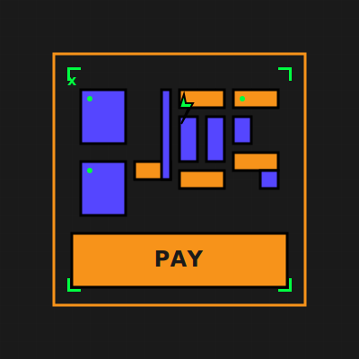

<p align="center">
  
</p>

# ⚡ x402Pay — HTTP 402 Payment Protocol for Bitcoin

> **HTTP 402 Payment Required. Bitcoin-native micropayments. Zero intermediaries.**

x402Pay implements the long-awaited HTTP 402 Payment Required status code with Bitcoin-native micropayments. Built on [Stacks](https://www.stacks.co/), it enables direct creator-to-consumer payments without email, passwords, or traditional payment processors.

**Live Demo**: [x402pay-app.vercel.app](https://x402pay-app.vercel.app)  
**Interactive x402 Demo**: [x402pay-app.vercel.app/x402-demo](https://x402pay-app.vercel.app/x402-demo)  
**Subscriptions**: [x402pay-app.vercel.app/subscribe](https://x402pay-app.vercel.app/subscribe)  
**Contracts**: [x402pay-app.vercel.app/contracts](https://x402pay-app.vercel.app/contracts)  
**npm**: [@x402pay/sdk](https://www.npmjs.com/package/@x402pay/sdk) - `npm install @x402pay/sdk`

**Deployed Contracts** (9 contracts, 2,163 lines of Clarity):
- [`revenue-split`](https://explorer.hiro.so/txid/STZMYH3JZXAHA1E993K0AATCCAAPTTFQVHWCVARF.revenue-split?chain=testnet) - Multi-party payment distribution
- [`subscription-manager`](https://explorer.hiro.so/txid/0x7f0f6181f3f026e1349e7a1d3d51ed72f0d9828f74a9f5f18567f925eaf94155?chain=testnet) - Recurring billing
- [`subscription-autopay`](https://explorer.hiro.so/txid/STZMYH3JZXAHA1E993K0AATCCAAPTTFQVHWCVARF.subscription-autopay?chain=testnet) - **Automated charges with 3-strike system**
- [`revenue-optimizer`](https://explorer.hiro.so/txid/STZMYH3JZXAHA1E993K0AATCCAAPTTFQVHWCVARF.revenue-optimizer?chain=testnet) - **DeFi yield optimization**
- [`stacking-dao-adapter`](https://explorer.hiro.so/txid/STZMYH3JZXAHA1E993K0AATCCAAPTTFQVHWCVARF.stacking-dao-adapter?chain=testnet) - **Liquid staking integration**
- [`escrow-refund`](https://explorer.hiro.so/txid/0x4698b9114d00dcc8adacfe6befdd6bac6739c106e2c78b3b9375be116f199227?chain=testnet) - Refundable payments
- [`time-gated-access`](https://explorer.hiro.so/txid/0x365a6e601c50070890e45558bb75e4c6f023ba3a3c7dcf79a1c3f141a44c1f31?chain=testnet) - Time-based paywalls
- [`royalty-cascade`](https://explorer.hiro.so/txid/0xad620a2cc3886b79673bead37112f5929488e5d88984d354bcdcd2941866198e?chain=testnet) - Perpetual royalties
- [`tiered-pricing`](https://explorer.hiro.so/txid/0xe74ec60f13a95200e5f251408cbe5af736d5066e1be95c439a476563f7ca48da?chain=testnet) - Dynamic pricing tiers

---

## 🏗️ Architecture Overview

```
┌─────────────────────────────────────────────────────────────────────┐
│                    x402Pay HTTP 402 Platform                        │
├──────────────┬───────────────────┬──────────────────┬──────────────┤
│  frontend/   │  backend/         │  contracts/      │  relayer/    │
│  Next.js 16  │  x402 Gateway     │  Clarity v2      │  Node.js     │
│  TailwindCSS │  Payment Verify   │  9 Contracts     │  Autopay     │
│  shadcn/ui   │  Protected APIs   │  DeFi Yield      │  Job Queue   │
│  PWA Ready   │  Stats Tracking   │  PoX-4 Stacking  │  3-Strike    │
└──────────────┴───────────────────┴──────────────────┴──────────────┘
```

| Layer | Stack | Purpose |
|-------|-------|---------|
| **Frontend** | Next.js 16, React 19, TailwindCSS, shadcn/ui | Interactive x402 demo, wallet connect, subscription management |
| **Backend** | Node.js API Routes | HTTP 402 implementation, payment verification, protected content access |
| **Contracts** | Clarity v2 (Stacks L2) | 9-contract suite: subscriptions, autopay, DeFi yield, PoX-4 |
| **Relayer** | Node.js, Bull Queue, Resend | Off-chain autopay automation, 3-strike system, email notifications |
| **WordPress** | PHP Plugin | One-click integration, shortcodes, admin panel |

---

## 🔑 Key Features

### 💳 HTTP 402 Payment Protocol
- **True Implementation**: HTTP 402 Payment Required status code (30 years in the making)
- **Bitcoin Native**: Direct wallet-to-creator payments, no intermediaries
- **Access Tokens**: JWT-based post-payment authentication
- **Protected Content**: APIs that return 402 until payment is verified

### 🎯 Interactive Demo Experience
- **Step-by-Step Flow**: Visual 5-step payment process
- **Real-Time Stats**: Transaction tracking and revenue dashboard
- **Professional UI**: Loading states, error handling, user feedback
- **Educational**: Learn about HTTP 402 and micropayments
### 🚀 Quick Start

#### Experience HTTP 402 in Action
1. **Visit Demo**: [x402pay-app.vercel.app/x402-demo](https://x402pay-app.vercel.app/x402-demo)
2. **Request Protected Content**: See HTTP 402 Payment Required
3. **Simulate Payment**: Submit transaction hash for verification
4. **Access Content**: Receive JWT token and unlock protected resources
5. **View Stats**: Real-time transaction tracking and revenue

#### API Usage Example
```javascript
// Step 1: Try to access protected content
const response = await fetch('/api/ai/generate');
// Returns: 402 Payment Required

// Step 2: Complete payment
const payment = await fetch('/api/x402/verify', {
  method: 'POST',
  body: JSON.stringify({
    txHash: '0x1234...',
    walletAddress: 'ST1...',
    amount: 1
  })
});
// Returns: { accessToken: 'jwt-token...' }

// Step 3: Access content with token
const content = await fetch('/api/ai/generate', {
  headers: { 'Authorization': `Bearer ${accessToken}` }
});
// Returns: AI-generated content
```
- **Yield Dashboard**: Real-time APY tracking across all DeFi protocols

### 🎯 Zero-Friction User Experience
- **Magic Link Authentication**: Email-based onboarding, no wallet required
- **Custodial Wallet Auto-Creation**: Automatic wallet generation with 5 STX airdrop
- **Progressive Web App (PWA)**: Install on mobile, offline support, push notifications
- **WordPress Plugin**: One-click integration with shortcodes `[x402pay_subscribe]` and `[x402pay_paywall]`
- **Multi-Platform**: Web SDK, WordPress, mobile PWA

### 🔐 9-Contract Clarity Suite (2,163 lines)
- **Subscription Manager**: Recurring monthly/annual billing with auto-renew
- **Subscription Autopay**: Automated charges with relayer integration
- **Revenue Optimizer**: DeFi yield routing and rebalancing logic
- **StackingDAO Adapter**: Liquid staking integration for stSTX
- **Revenue Split**: Creator/platform/collaborator shares per content
- **Escrow with Refunds**: Refundable payments with dispute resolution
- **Time-Gated Access**: Paywall window that expires to free (journalism model)
- **Royalty Cascade**: Perpetual creator royalties on every resale
- **Tiered Pricing**: Dynamic pricing by buyer tier (student, business, nonprofit)

### 🤖 AI Agent Marketplace 
- **Native Agent Marketplace**: Browse and hire AI agents for content creation, research, and optimization
- **Bitcoin-Native Payments**: Hire agents with x402 protocol and STX payments
- **Sophisticated UI**: Glassmorphism design, gradients, and smooth animations
- **Agent Categories**: Content writers, researchers, analysts, developers, marketers
- **Reputation System**: Track agent performance, success rates, and earnings
- **Real-time Availability**: See which agents are currently available for hire
- **Integrated Dashboard**: Seamless navigation between marketplace and subscription management

### 🤖 AI Agent Detection & x402 Protocol
- **x402 v2 Compatible**: Coinbase standard with `PAYMENT-REQUIRED`, `PAYMENT-SIGNATURE`, `PAYMENT-RESPONSE` headers
- **CAIP-2 Network IDs**: `stacks:1` (mainnet), `stacks:2147483648` (testnet)
- **Heuristic Detection**: User-Agent pattern matching for AI agents
- **Groq-Powered Classification**: LLM-based agent identification
- **Agent-Aware Analytics**: Separate tracking for human vs. AI payments

---

## 🎨 Design System — Bitcoin Brutalist

- **Zero border-radius** — every element is angular
- **Heavy 2px+ borders** — structural, not decorative
- **Mono typography** — JetBrains Mono throughout
- **Color palette** — Bitcoin Orange `#F7931A`, Stacks Purple `#5546FF`, Success Green `#00FF41`, Charcoal `#1A1A1A`
- **Micro-interactions** — translate-on-hover, glitch animations, blinking cursors
- **Grid overlays** — subtle engineering-blueprint aesthetic

---

## 📂 Project Structure

```
x402Pay/
├── frontend/                # Next.js app (20,498 lines TypeScript)
│   ├── app/                 # App Router pages
│   │   ├── subscribe/       # Subscription enrollment UI
│   │   ├── agents/          # AI Agent Marketplace (NEW!)
│   │   ├── yield/           # DeFi yield dashboard with APY tracking
│   │   ├── dashboard/       # Analytics and subscription management
│   │   │   └── agents/      # Dashboard agent overview
│   │   └── contracts/       # Live contract interaction demos
│   ├── components/          # Landing, dashboard, UI components (shadcn/ui)
│   │   ├── magic-link-modal.tsx           # Email-based onboarding
│   │   └── subscription-enrollment-dialog.tsx
│   ├── hooks/               # use-x402, use-realtime-payments, use-realtime-analytics
│   ├── contexts/            # Auth + Wallet providers
│   ├── lib/                 # Supabase client, subscription contract helpers
│   ├── public/              # PWA manifest, service worker, icons
│   ├── __tests__/           # Vitest + RTL test suites (15 files, 80 tests)
│   └── vitest.config.ts     # Test + coverage configuration
├── backend/
│   ├── relayer/             # Node.js autopay service
│   │   ├── src/
│   │   │   ├── index.ts     # Main relayer loop
│   │   │   ├── job-processor.ts          # 3-strike charge logic
│   │   │   └── notifications.ts          # Resend email integration
│   │   └── package.json     # Bull queue, @stacks/transactions
│   └── supabase/
│       ├── functions/       # Edge Functions (Deno)
│       │   ├── subscription-manage/      # Subscription CRUD + relayer jobs
│       │   ├── create-custodial-wallet/  # Auto wallet + 5 STX airdrop
│       │   ├── auth-wallet/
│       │   ├── verify-payment/
│       │   ├── analytics-processor/
│       │   ├── agent-detect/
│       │   └── x402-gateway/
│       └── migrations/      # 4 SQL migrations (analytics, subscriptions, custodial wallets)
├── contracts/
│   └── x402pay-contracts/  # 9 Clarity v2 contracts (2,163 lines)
│       ├── contracts/
│       │   ├── subscription-manager.clar
│       │   ├── subscription-autopay.clar      # NEW: Relayer integration
│       │   ├── revenue-optimizer.clar         # NEW: DeFi yield routing
│       │   ├── stacking-dao-adapter.clar      # NEW: Liquid staking
│       │   ├── revenue-split.clar
│       │   ├── escrow-refund.clar
│       │   ├── time-gated-access.clar
│       │   ├── royalty-cascade.clar
│       │   └── tiered-pricing.clar
│       ├── tests/           # Clarinet + Vitest (404 tests)
│       └── deployments/     # Testnet deployment plans
├── wordpress-plugin/
│   └── x402pay-subscriptions/
│       ├── x402pay-subscriptions.php    # Main plugin file
│       ├── assets/
│       │   ├── x402pay.js               # Frontend integration
│       │   └── x402pay.css              # Brutalist styling
│       └── x402pay-subscriptions.zip    # Ready to distribute
└── .gitignore               # Covers .env, secrets, build artifacts
```

---

## 🚀 Quick Start

### Prerequisites

- **Node.js** ≥ 20
- **pnpm** ≥ 9
- **Supabase CLI** (for backend Edge Functions)
- **Clarinet** (for Clarity contract development)

### 1. Clone & Install

```bash
git clone https://github.com/austinLorenzMccoy/x402pay.git
cd x402pay
```

### 2. Frontend

```bash
cd frontend
pnpm install
cp .env.local.example .env.local   # Add your Supabase + contract credentials
pnpm dev                           # → http://localhost:3000
```

### 3. Backend (Supabase Edge Functions)

**Local Development:**
```bash
cd backend/supabase
cp .env.example .env               # Add Supabase, Groq, Stacks API keys
supabase start                     # Local Supabase instance
supabase functions serve           # Serve Edge Functions locally
```

**Deploy to Production:**
```bash
# Login to Supabase
supabase login

# Add secrets to Supabase Vault (Dashboard → Integrations → Vault)
# Required: RESEND_API_KEY, SUPABASE_URL, SUPABASE_SERVICE_ROLE_KEY, 
#           STACKS_API_URL, GROQ_API_KEY, FRONTEND_URL

# Deploy functions
cd /path/to/x402Pay
supabase functions deploy task-completion-notification --workdir backend/supabase --use-api
# Repeat for other functions as needed
```

### 4. Contracts

```bash
cd contracts/x402pay-contracts
clarinet check                     # Validate Clarity v2 syntax
npm install && npm test            # Run contract test suite
```

---

## 🧪 Testing

| Area | Runner | Command |
|------|--------|---------|
| **Frontend** | Vitest + React Testing Library | `cd frontend && pnpm test` |
| **Frontend Coverage** | Vitest + v8 | `cd frontend && pnpm test:coverage` |
| **Contracts** | Clarinet + Vitest | `cd contracts/x402pay-contracts && npm test` |
| **Backend** | Deno test | `deno test backend/supabase/functions/` |
| **Relayer** | Jest | `cd backend/relayer && npm test` |

### Current Status

```
Frontend:   15 test files, 80 tests passing
Backend:     7 Deno tests passing (agent detection, x402 gateway)
Contracts:   9 test files, 404 tests passing (9-contract suite)
Relayer:     Job queue, 3-strike logic, notification tests
Total:       500+ tests across full stack
```

---

## 🔑 Environment Variables

### Frontend (`frontend/.env.local`)

```env
NEXT_PUBLIC_SUPABASE_URL=https://your-project.supabase.co
NEXT_PUBLIC_SUPABASE_ANON_KEY=eyJhbGciOi...

# Deployed contracts (Stacks testnet)
NEXT_PUBLIC_CONTRACT_ADDRESS=STZMYH3JZXAHA1E993K0AATCCAAPTTFQVHWCVARF.revenue-split
NEXT_PUBLIC_SUBSCRIPTION_CONTRACT_ADDRESS=STZMYH3JZXAHA1E993K0AATCCAAPTTFQVHWCVARF.subscription-autopay
NEXT_PUBLIC_REVENUE_OPTIMIZER_CONTRACT=STZMYH3JZXAHA1E993K0AATCCAAPTTFQVHWCVARF.revenue-optimizer
NEXT_PUBLIC_STACKING_DAO_ADAPTER_CONTRACT=STZMYH3JZXAHA1E993K0AATCCAAPTTFQVHWCVARF.stacking-dao-adapter

# Merchant/Platform principal
NEXT_PUBLIC_MERCHANT_PRINCIPAL=STZMYH3JZXAHA1E993K0AATCCAAPTTFQVHWCVARF

# Stacks network
NEXT_PUBLIC_STACKS_NETWORK=testnet
NEXT_PUBLIC_STACKS_API_URL=https://api.testnet.hiro.so
```

### Backend (Supabase Functions)

```env
SUPABASE_URL=https://your-project.supabase.co
SUPABASE_SERVICE_ROLE_KEY=eyJhbGciOi...   # Never expose to frontend
STACKS_API_URL=https://api.testnet.hiro.so
DEFAULT_MERCHANT_PRINCIPAL=STZMYH3JZXAHA1E993K0AATCCAAPTTFQVHWCVARF
SUBSCRIPTION_CONTRACT_ADDRESS=STZMYH3JZXAHA1E993K0AATCCAAPTTFQVHWCVARF.subscription-autopay
FAUCET_PRIVATE_KEY=c6eaa960fb68110acdbc...  # For custodial wallet airdrops
GROQ_API_KEY=gsk_...                        # For AI agent classification
RESEND_API_KEY=re_...                       # For email notifications
FRONTEND_URL=http://localhost:3000
```

### Relayer (`backend/relayer/.env`)

```env
SUPABASE_URL=https://your-project.supabase.co
SUPABASE_SERVICE_ROLE_KEY=eyJhbGciOi...
RELAYER_PRIVATE_KEY=c6eaa960fb68110acdbc...  # Funded wallet for autopay charges
STACKS_API_URL=https://api.testnet.hiro.so
SUBSCRIPTION_CONTRACT_ADDRESS=STZMYH3JZXAHA1E993K0AATCCAAPTTFQVHWCVARF.subscription-autopay
RESEND_API_KEY=re_...                        # For payment failure emails
```

---

## � Deployment & Authentication

### Vercel Deployment Setup

1. **Frontend Environment Variables** (Vercel → Settings → Environment Variables):
```env
# Supabase Configuration
NEXT_PUBLIC_SUPABASE_URL=https://your-project.supabase.co
NEXT_PUBLIC_SUPABASE_ANON_KEY=eyJhbGciOi...
SUPABASE_SERVICE_KEY=eyJhbGciOi...

# App Configuration (critical for magic links)
NEXT_PUBLIC_APP_URL=https://x402pay-app.vercel.app
NEXT_PUBLIC_APP_NAME=x402pay
NEXT_PUBLIC_APP_DESCRIPTION=Bitcoin-native creator monetization platform

# Magic Link Authentication
RESEND_API_KEY=re_your_resend_api_key
RESEND_FROM_EMAIL=noreply@x402pay.com

# WalletConnect (optional)
NEXT_PUBLIC_WALLETCONNECT_PROJECT_ID=your_walletconnect_project_id

# Stacks Contracts
NEXT_PUBLIC_CONTRACT_ADDRESS=STZMYH3JZXAHA1E993K0AATCCAAPTTFQVHWCVARF.revenue-split
NEXT_PUBLIC_SUBSCRIPTION_CONTRACT_ADDRESS=STZMYH3JZXAHA1E993K0AATCCAAPTTFQVHWCVARF.subscription-autopay
# ... other contracts
```

2. **User Authentication Flow**:
   - **Step 1**: Connect Bitcoin wallet (Xverse/Leather, not MetaMask)
   - **Step 2**: Enter email for magic link authentication
   - **Step 3**: Click magic link in email → redirects to live site
   - **Step 4**: Subscribe with automated billing

3. **Build Configuration**:
   - Uses **Webpack** (not Turbopack) for ESM/CJS compatibility
   - Transpiles Stacks packages for browser compatibility
   - See `frontend/README.md` for troubleshooting

### Common Issues & Fixes

- **Magic link redirects to localhost**: Set `NEXT_PUBLIC_APP_URL` to live site
- **MetaMask connection errors**: Use Xverse or Leather wallet instead
- **Module factory errors**: Use webpack build (`pnpm dev` not `pnpm dev:turbo`)
- **Email not sending**: Configure Resend API keys in Vercel environment

---

## �🔄 x402 Protocol Flow

```
┌──────────┐  1. GET /resource    ┌──────────────┐
│  Client   │────────────────────▶│  x402        │
│  (Human   │                     │  Gateway     │
│  or Agent)│◀────────────────────│              │
│           │  2. 402 + PAYMENT-  │  Detects     │
│           │     REQUIRED header │  AI agents   │
│           │                     └──────┬───────┘
│           │  3. POST + PAYMENT-        │
│           │     SIGNATURE header       │ 4. Verify tx
│           │────────────────────▶       │    on Stacks
│           │                            ▼
│           │  5. 200 + PAYMENT-  ┌──────────────┐
│           │◀── RESPONSE header  │  Stacks      │
└──────────┘                      │  Blockchain  │
                                  └──────────────┘
```

---

## 💰 Supported Assets

| Asset | Type | Use Case |
|-------|------|----------|
| **STX** | Stacks native | Low-fee paywalls, stacking yield |
| **sBTC** | Wrapped Bitcoin | Premium content, high-security drops |
| **USDCx** | Stablecoin | Subscriptions, stable payouts |

---

## 📖 Documentation

Internal design docs, PRDs, and video scripts now live outside this repo to keep the tree lean. Ping the team for the latest shared drive if you need them.

---

## 📜 License

MIT — Built on Stacks. Hardened for Agents. Stacked for Creators.
